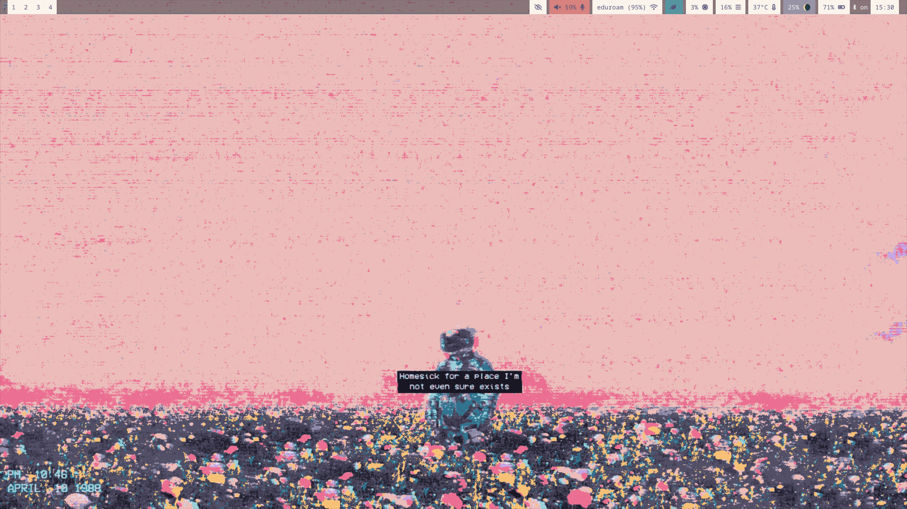
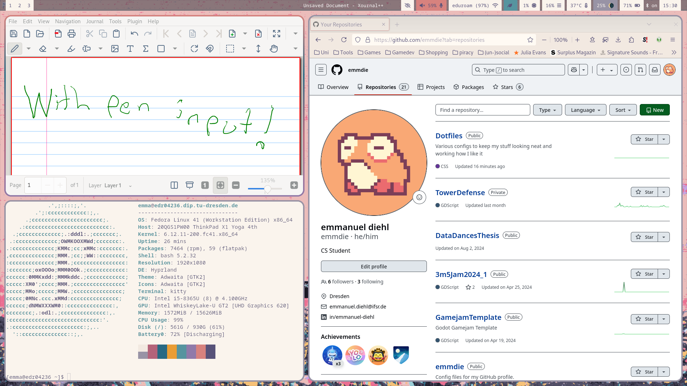

# Config files
## Screenshots

## Description
This repo contains various configuration files for my laptop using the Hyprland compositor with a focus on providing good experience on my 2-in-1 Laptop. 
## Configs
It includes my configs for:
### Hyprland
Featuring:
- Screenshot functionality using slurp and grim on the PRINT key. 
- Laptop funtion keys for volume, brightness, mute, etc.
- Theming 
### Hyprlock

### Waybar

Everything is styled using the amazing [Rosé Pine theme](https://rosepinetheme.com/)
