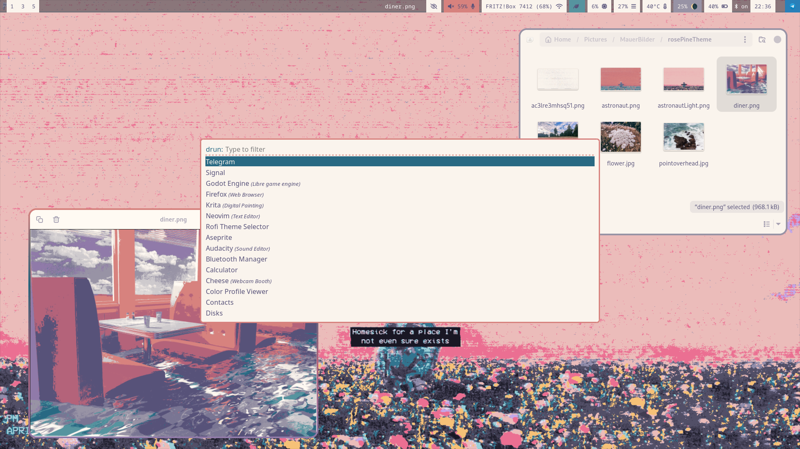
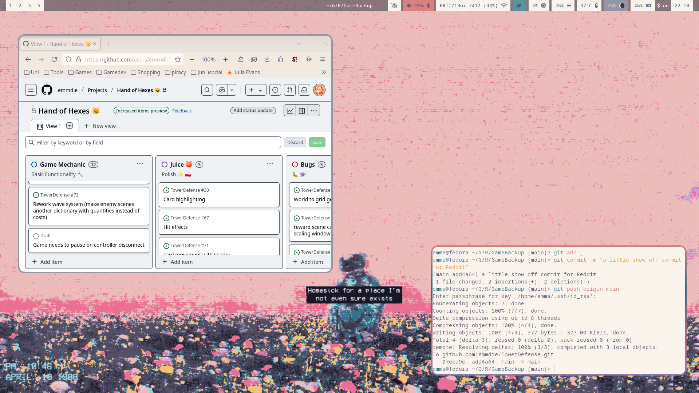
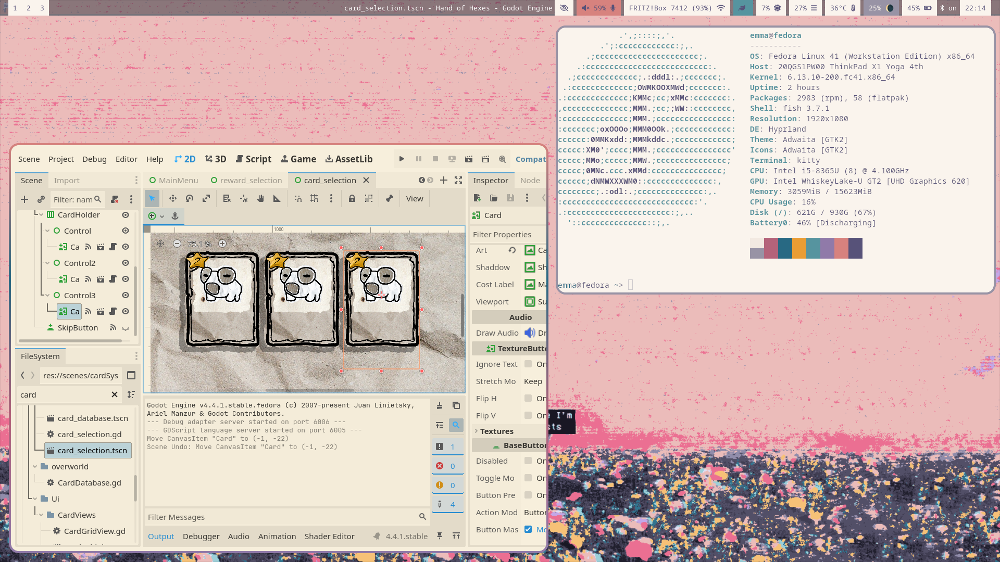
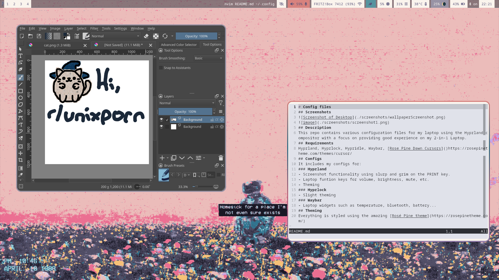

# My Hyprland setup
This repo contains various configuration files for my laptop using the Hyprland compositor with a focus on providing good experience on my 2-in-1 Laptop. Half for others to copy, half note and backup for myself. 

# Screenshots

# Setup
## Colours
[Rose Pine Dawn](https://rosepinetheme.com/) for everything
## Cursor
[Rose Pine Dawn Cursors(https://rosepinetheme.com/themes/cursor/)
## Compositor
Hyprland
- Screenshot functionality using slurp and grim on the PRINT key. 
- Laptop funtion keys for volume, brightness, mute, etc.
- Theming 
### Hyprlock
- Slight theming
- screen stays on when watching videos
- Auto Lock using Hypridle
### Waybar
- Laptop widgets such as temperature, bluetooth, battery...
## Application launcher
- Rofi
## Terminal
Kitty
## Shell
Fish
